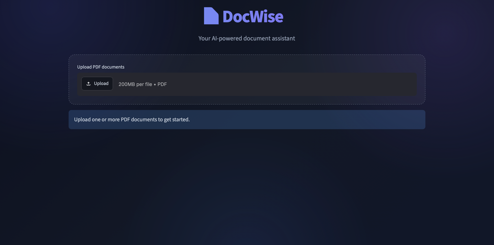
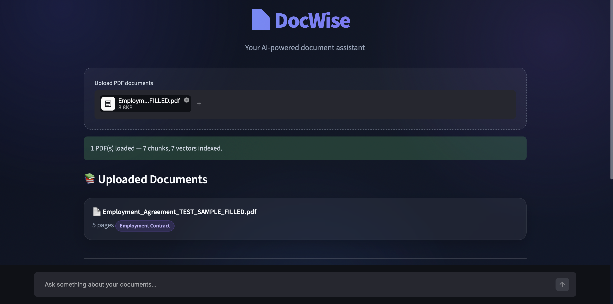
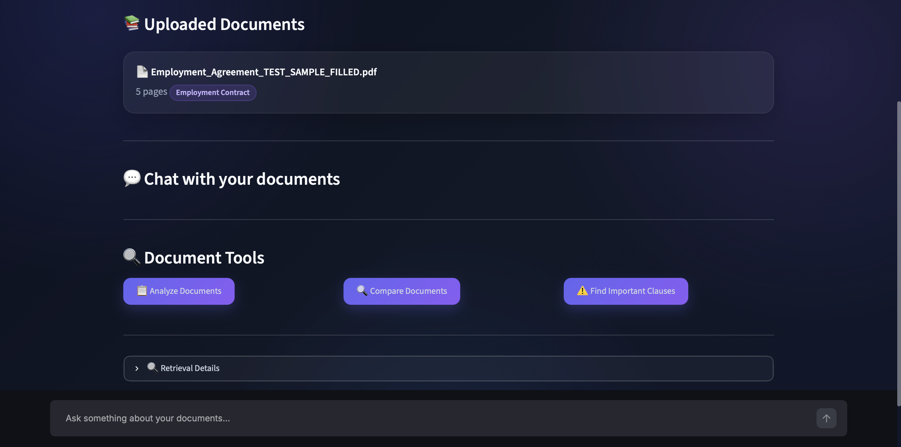
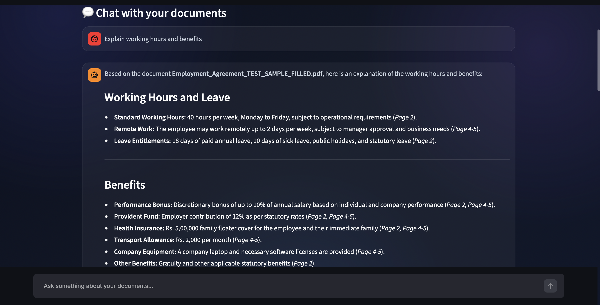
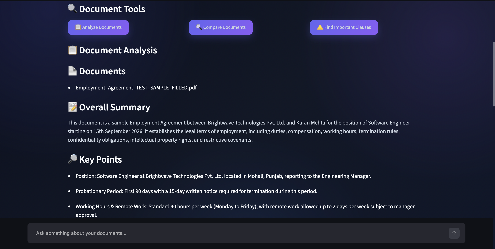
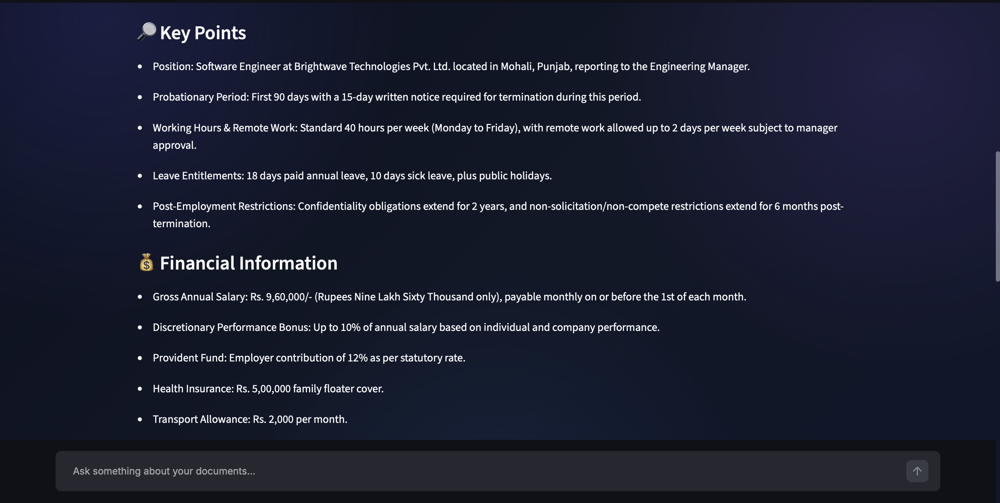
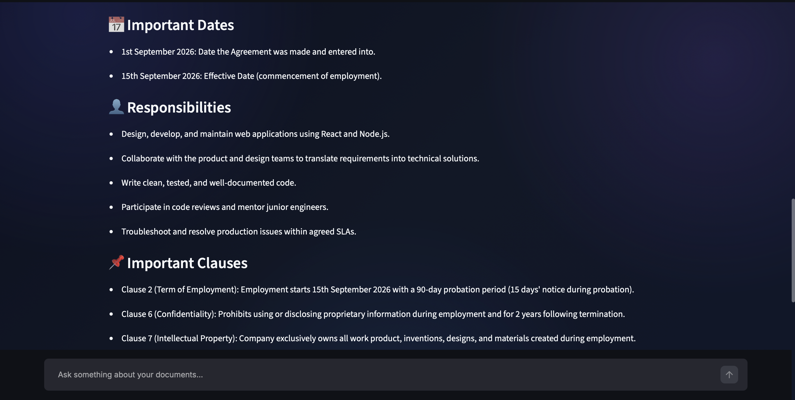
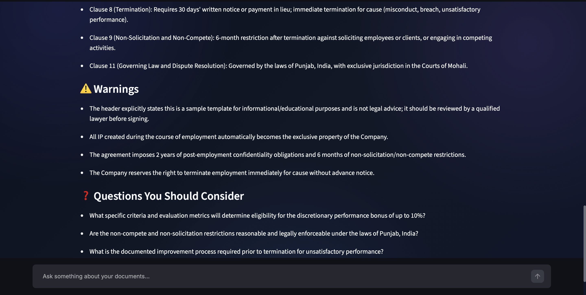

# 📄 DocWise

### AI-Powered Document Assistant

DocWise is an AI-powered document assistant that helps users understand and interact with PDF documents using **Google Gemini, semantic search, FAISS, and Streamlit**.

Upload one or more PDF documents, ask questions about their contents, and get concise answers with relevant document sources. DocWise can also analyze documents and extract important information such as key points, financial details, dates, responsibilities, clauses, and potential warnings.

---

## ✨ Features

* 📄 **PDF Upload**

  * Upload one or multiple PDF documents.
  * Extract text from PDF pages using PyMuPDF.

* 🤖 **AI-Powered Document Analysis**

  * Analyze documents using Google Gemini.
  * Identify document types.
  * Generate summaries and important information.
  * Highlight financial information, dates, responsibilities, clauses, and warnings.

* 💬 **Document Chat**

  * Ask questions about uploaded documents.
  * Maintain conversation context during the active session.
  * Get concise answers based only on the uploaded documents.

* 🔎 **Semantic Search**

  * Convert document chunks and questions into embeddings.
  * Use FAISS for fast similarity-based retrieval.
  * Retrieve the most relevant sections before generating an answer.

* 📚 **Multiple Document Support**

  * Upload and search across multiple PDFs.
  * Identify which document contains the relevant information.
  * Display document and page information with retrieved sources.

* 📌 **Source References**

  * Every retrieved answer can be traced back to the relevant document and page.
  * View the original text used to generate the answer.

* 📊 **Document Information**

  * View uploaded documents.
  * View page and chunk counts.
  * Inspect retrieved chunks and similarity distances.

* 🎨 **Modern User Interface**

  * Built with Streamlit.
  * Responsive dark-themed interface.
  * Custom typography and styling.
  * Interactive cards, buttons, chat messages, and expanders.

* 🔐 **Environment Variable Support**

  * Gemini API keys are stored in `.env`.
  * Sensitive credentials are excluded from Git using `.gitignore`.

---

## 🛠️ Tech Stack

| Technology            | Purpose                                  |
| --------------------- | ---------------------------------------- |
| **Python**            | Core programming language                |
| **Streamlit**         | Web application interface                |
| **Google Gemini API** | Document analysis and question answering |
| **Google GenAI SDK**  | Communication with Gemini models         |
| **Gemini Embeddings** | Generate semantic embeddings             |
| **FAISS**             | Vector similarity search                 |
| **NumPy**             | Numerical and embedding operations       |
| **PyMuPDF**           | PDF text extraction                      |
| **python-dotenv**     | Environment variable management          |

---

## 🧠 How DocWise Works

DocWise follows a Retrieval-Augmented Generation (RAG) workflow.

```text
                PDF Documents
                     │
                     ▼
              ┌──────────────┐
              │ PyMuPDF      │
              │ Text Extract │
              └──────┬───────┘
                     │
                     ▼
              ┌──────────────┐
              │   Chunking   │
              └──────┬───────┘
                     │
                     ▼
              ┌──────────────┐
              │  Embeddings  │
              │ Gemini Model │
              └──────┬───────┘
                     │
                     ▼
              ┌──────────────┐
              │    FAISS     │
              │ Vector Index │
              └──────┬───────┘
                     │
              User Question
                     │
                     ▼
              ┌──────────────┐
              │   Semantic   │
              │    Search    │
              └──────┬───────┘
                     │
                     ▼
              Relevant Chunks
                     │
                     ▼
              ┌──────────────┐
              │ Gemini Model │
              │ Answer Gen.  │
              └──────┬───────┘
                     │
                     ▼
              Answer + Sources
```

### Workflow

1. User uploads a PDF.
2. DocWise extracts text from each page.
3. The extracted text is divided into smaller chunks.
4. Gemini generates embeddings for each chunk.
5. FAISS stores the embeddings for similarity search.
6. The user asks a question.
7. The question is converted into an embedding.
8. FAISS retrieves the most relevant document chunks.
9. Relevant chunks are provided to Gemini.
10. Gemini generates an answer using the retrieved document information.
11. DocWise displays the answer along with its document and page sources.

---

## 📦 Installation

### 1. Clone the Repository

```bash
git clone https://github.com/Krishan81/DocWise.git
```

Move into the project directory:

```bash
cd Docwise
```

---

### 2. Create a Virtual Environment

Create a Python virtual environment:

```bash
python -m venv venv
```

Activate it on macOS/Linux:

```bash
source venv/bin/activate
```

On Windows:

```bash
venv\Scripts\activate
```

---

### 3. Install Dependencies

Install the required packages:

```bash
pip install -r requirements.txt
```

---

## 🔑 Environment Setup

DocWise requires a **Google Gemini API key**.

### 1. Create a Gemini API Key

Create your API key through Google AI Studio.

Do **not** place your API key directly inside Python source code.

---

### 2. Create a `.env` File

Inside the project directory, create:

```text
.env
```

Add:

```env
GEMINI_API_KEY=your_gemini_api_key_here
```

Your project should look like:

```text
Docwise/
├── app.py
├── vector_store.py
├── pdf_loader.py
├── chunker.py
├── requirements.txt
├── .env
├── .env.example
└── .gitignore
```

### ⚠️ Important

Never upload `.env` to GitHub.

The repository should contain:

```text
.env.example
```

with:

```env
GEMINI_API_KEY=your_gemini_api_key_here
```

but your actual `.env` should remain private.

---

## ▶️ Usage

After completing the installation and environment setup, start DocWise with:

```bash
streamlit run app.py
```

Streamlit will provide a local URL, usually:

```text
http://localhost:8501
```

Open the URL in your browser.

### Step 1 — Upload Documents

Upload one or more PDF documents.

```text
📄 Employment Contract.pdf
📄 Property Agreement.pdf
📄 Tenant Contract.pdf
```

DocWise will process the documents and display their basic information.

### Step 2 — Ask Questions

Use the chat box to ask questions such as:

```text
What is the notice period?
```

```text
What is the monthly rent?
```

```text
What are the employee's responsibilities?
```

```text
What are the important dates?
```

DocWise searches the uploaded documents and provides an answer based on the relevant sections.

### Step 3 — View Sources

The application displays the document and page associated with retrieved information.

You can expand the source section to view the original text used for the answer.

### Step 4 — Analyze Documents

Use:

```text
Analyze Documents
```

to generate a structured analysis containing:

* Document type
* Overall summary
* Key points
* Financial information
* Important dates
* Responsibilities
* Important clauses
* Warnings
* Questions to consider

---

## 📁 Project Structure

```text
Docwise/
│
├── app.py
│   └── Main Streamlit application
│
├── pdf_loader.py
│   └── Extracts text from PDF documents
│
├── chunker.py
│   └── Splits extracted text into smaller chunks
│
├── vector_store.py
│   ├── Generates embeddings
│   ├── Creates FAISS index
│   ├── Searches relevant chunks
│   ├── Creates document context
│   ├── Generates answers
│   └── Handles document-related AI functions
│
├── requirements.txt
│   └── Python dependencies
│
├── .env
│   └── Local API credentials
│
├── .env.example
│   └── Example environment configuration
│
├── .gitignore
│   └── Prevents sensitive/unnecessary files from being committed
│
└── README.md
    └── Project documentation
```

---

## 🖼️ Screenshots

### 🏠 Main Interface

<p align="center">
  
</p>

### 📄 Document Upload

<p align="center">
  
  
</p>

### 💬 Document Chat

<p align="center">
  
</p>

### 📋 Document Analysis

<p align="center">
  
  
  
  
</p>

---

## 🔒 Security

DocWise uses environment variables to protect API credentials.

The following files should **never** be committed:

```text
.env
venv/
.venv/
.streamlit/secrets.toml
```

Make sure `.gitignore` contains:

```gitignore
.env
.env.*
venv/
.venv/
.streamlit/secrets.toml
__pycache__/
.DS_Store
```

If an API key is accidentally pushed to GitHub, revoke it immediately and create a new one.

---

## ⚠️ Limitations

- **Gemini API usage limits** — DocWise currently relies on the Gemini API for embeddings, document classification, question answering, and document analysis. The free API tier has usage limits, so repeated testing or processing multiple documents can temporarily cause quota errors.
- **API availability** — Sometimes Gemini requests may fail due to temporary rate limits or high demand. Retrying after some time usually resolves this.
- **Scanned PDFs** — Image-only or scanned PDFs may not work properly because the current version relies on text extraction.
- **Large documents** — Processing many large PDFs can increase processing time, API usage, and memory consumption.
- **Session-based data** — Documents and chat history are currently available only during the active session and aren't permanently stored.
* Scanned/image-only PDFs may not be processed correctly because they require OCR.
* Document processing currently depends on Gemini API availability and quota.
* Embeddings and indexes are primarily handled during the active application session.
* Very large documents may require additional optimization.
* AI-generated answers should be verified against the original document.
* DocWise is an information-extraction and document-understanding tool and does **not provide legal advice**.

---

## 🚀 Future Improvements

* **Persistent document processing** — store processed documents, chunks, and FAISS indexes so the same PDFs do not need to be processed again.

* **OCR support for scanned PDFs** — add OCR functionality to process image-based and scanned documents.

* **Improved retrieval accuracy** — introduce hybrid search, query expansion, reranking, and improved duplicate handling.

* **Token-aware chunking** — replace character-based chunking with token-based chunking for more predictable context usage.

* **Answer streaming** — stream Gemini responses as they are generated for a more responsive chat experience.

* **Persistent chat history** — allow users to save and return to previous document conversations.

* **User authentication and access control** — allow users to securely manage their documents and conversations.

* **Document comparison** — compare multiple documents and identify differences in clauses, dates, amounts, responsibilities, and other important information.

* **More document formats** — support DOCX, TXT, and other commonly used document formats.

* **Automated testing** — add unit and integration tests for PDF extraction, chunking, embeddings, retrieval, and AI responses.

* **Production optimization** — improve caching, API usage, rate-limit handling, error recovery, and background processing for larger-scale deployment.

---

## 🧪 Example Use Cases

DocWise can be useful for understanding different types of documents, including:

### 🏠 Rental/Tenant Documents

Ask:

```text
What is the monthly rent?
```

```text
What is the security deposit?
```

```text
What is the notice period?
```

### 💼 Employment Contracts

Ask:

```text
What is the employee's salary?
```

```text
What are the employee's responsibilities?
```

```text
What is the termination notice period?
```

### 🏢 Property Documents

Ask:

```text
Who are the parties involved?
```

```text
What is the property value?
```

```text
What are the important conditions?
```

---

## 🧑‍💻 Development

To run the project locally:

```bash
source venv/bin/activate
streamlit run app.py
```

When making changes, Streamlit automatically reloads the application during development.

Before committing changes:

```bash
git status
```

Check that sensitive files such as `.env` are not included.

Then:

```bash
git add .
git commit -m "Update DocWise"
git push origin main
```

---

## 📌 Disclaimer

DocWise is designed to help users understand and navigate documents more easily.

It is **not a replacement for a lawyer, financial advisor, HR professional, or other qualified professional**. Information generated by AI may contain errors, so important decisions should always be verified against the original document and, when appropriate, reviewed by a qualified professional.

---

## 📄 License

This project is licensed under the **MIT License**.

You are free to use, modify, and distribute this project according to the terms of the license.

See the `LICENSE` file for more information.

---

## ⭐ Support

If you find DocWise useful, consider giving the repository a ⭐ on GitHub.

Feedback, suggestions, and contributions are welcome.

